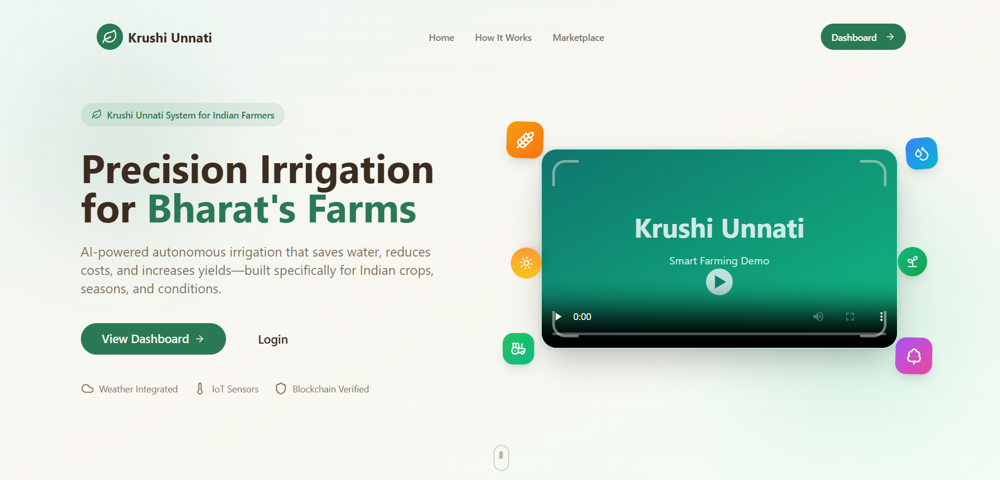

<div align="center">

  <h1>🌱 KrushiUnnati 🌱</h1>
  <h3><em>Smart Farming with AI, IoT & Blockchain Transparency</em></h3>

</div>

<!-- Terminal Intro Animation -->
<div align="center">
  
</div>


## 🚀 Live Demo

<div align="center">
  <a href="https://krushiunnati.onrender.com/">
    
  </a>
  <a href="https://huggingface.co/spaces/Deep08092006/KrushiUnnatiBackend">
    
  </a>
</div>

> [!IMPORTANT]
> **Demo Access Credentials (Twilio)**
> 
> Use the following credentials to test features requiring Twilio authentication:
> - **Number**: `7718839348`
> - **Password**: `123456`


## 🎯 Problem & Inspiration

<table>
<tr>
<td>

Traditional farming faces challenges like **unpredictable weather, pest attacks, lack of soil health awareness, and opaque supply chains**. Farmers often rely on outdated methods, leading to lower yields and financial losses. Additionally, the lack of a direct connection to markets leads to exploitation by middlemen.

**KrushiUnnati** revolutionizes agriculture by combining **AI-driven insights, real-time IoT monitoring, and Blockchain transparency**. It empowers farmers with precise crop recommendations, early disease detection, and a secure, transparent marketplace.

</td>
<td width="40%">

</td>
</tr>
</table>


## 💡 Key Features

<div align="center">
  <table>
    <tr>
      <td align="center"><h3>🤖</h3><h4>AI Disease Detection</h4><p>ResNet50-powered model to detect plant diseases from images</p></td>
      <td align="center"><h3>🌱</h3><h4>Crop Recommendation</h4><p>ML algorithms analyzing soil & weather for best crop choices</p></td>
    </tr>
    <tr>
      <td align="center"><h3>📡</h3><h4>IoT Monitoring</h4><p>Real-time soil readings (NPK, Moisture) via MQTT</p></td>
      <td align="center"><h3>⛓️</h3><h4>Blockchain Marketplace</h4><p>Transparent supply chain and fair prices via Web3</p></td>
    </tr>
    <tr>
      <td align="center"><h3>💬</h3><h4>AI Assistant</h4><p>GenAI-powered chatbot for 24/7 farming advice</p></td>
      <td align="center"><h3>🌐</h3><h4>Multilingual Support</h4><p>Accessible in local languages (Hindi/English) via i18n</p></td>
    </tr>
  </table>
</div>


## ⚙️ Tech Stack

<div align="center">

### Frontend
⚛️ React 18 • ⚡ Vite • 🔷 TypeScript • 🎨 Tailwind CSS • 🎭 Shadcn UI  
📊 Recharts • 🎢 Framer Motion • 🎲 React Three Fiber • 🌍 i18next

### Backend
🐍 Python • ⚡ FastAPI • 🚂 Uvicorn • 🤖 PyTorch (AI) • 🧠 Transformers  
🗄️ Supabase/PostgreSQL • 📡 Paho-MQTT • 🔌 Web3.py • 📨 Twilio

### AI & Data
🧠 ResNet50 (Disease Model) • 📊 Scikit-Learn • 🐼 Pandas • 🔢 NumPy  
🤖 Google Generative AI (Gemini) • 🔥 Torchvision

</div>


## 📂 Project Structure

```
Smart-Farming_HACK/
│
├── 📱 client/                      # React/Vite Frontend
│   ├── src/
│   │   ├── components/            # Shadcn & Custom Components
│   │   ├── pages/                 # Route Pages
│   │   └── ...
│   └── vite.config.ts             # Vite Configuration
│
├── 🔧 backend/                     # FastAPI Backend
│   ├── app/                       # App Logic
│   ├── main.py                    # Entry point
│   ├── requirements.txt           # Python dependencies
│   └── ...
│
├── 🧠 disease_model/               # AI Models
│   ├── models/                    # Serialized Models (.pth)
│   └── ...
│
├── 💾 datasets/                    # Crop & Fertilizer Data (CSV)
├── 📚 docs/                        # Documentation
│   ├── QUICK_START.md
│   ├── BACKEND_API_ENDPOINTS.md
│   └── TWILIO_SETUP.md
└── ...
```


## 🚀 Quick Start

See [docs/QUICK_START.md](./docs/QUICK_START.md) for detailed instructions.

### Prerequisites
```bash
Node.js v18+
Python 3.10+
PostgreSQL / Supabase
```

### 1️⃣ Clone the Repository
```bash
git clone https://github.com/Loki3306/Smart-Farming_HACK.git
cd Smart-Farming_HACK
```

### 2️⃣ Backend Setup
```bash
# Setup Env & Install
pip install -r backend/requirements.txt
# Run Server
python -m uvicorn app.main:app --reload
```

### 3️⃣ Frontend Setup
```bash
cd client
npm install && npm run dev
```


## 🔗 Documentation
- [📚 Backend API Endpoints](./docs/BACKEND_API_ENDPOINTS.md)
- [📧 Twilio Setup](./docs/TWILIO_SETUP.md)
- [🚀 Quick Start Guide](./docs/QUICK_START.md)


## 👥 Team KrushiUnnati

<div align="center">
  <table>
    <tr>
      <td align="center">
        <br>
        <h3>🧑💻 Abhishek Chaudhari</h3>
        <p>Full Stack Developer</p>
        <a href="https://www.linkedin.com/in/abhishek-chaudhari-949002356" target="_blank">
          
        </a>
        <a href="https://github.com/Abhi-786-coder" target="_blank">
          
        </a>
      </td>
      <td align="center">
        <br>
        <h3>🧑💻 Lokesh Gile</h3>
        <p>Blockchain Developer</p>
        <a href="https://www.linkedin.com/in/lokesh-gile-b61145248" target="_blank">
          
        </a>
        <a href="https://github.com/Loki3306" target="_blank">
          
        </a>
      </td>
    </tr>
    <tr>
      <td align="center">
        <br>
        <h3>🧑💻 Yug Deshmukh</h3>
        <p>Frontend Developer</p>
        <a href="https://www.linkedin.com/in/yugtheguy" target="_blank">
          
        </a>
        <a href="https://github.com/yugtheguy" target="_blank">
          
        </a>
      </td>
      <td align="center">
        <br>
        <h3>🧑💻 Deep Mehta</h3>
        <p>Backend Developer</p>
        <a href="https://www.linkedin.com/in/deep-mehta-857a09304" target="_blank">
          
        </a>
        <a href="https://github.com/DeepMehta06" target="_blank">
          
        </a>
      </td>
    </tr>
  </table>
</div>

---

<div align="center">
  <sub>Built with 💚 by the KrushiUnnati Team</sub>
  <br>
  <sub>Empowering Farmers with Technology</sub>
</div>
